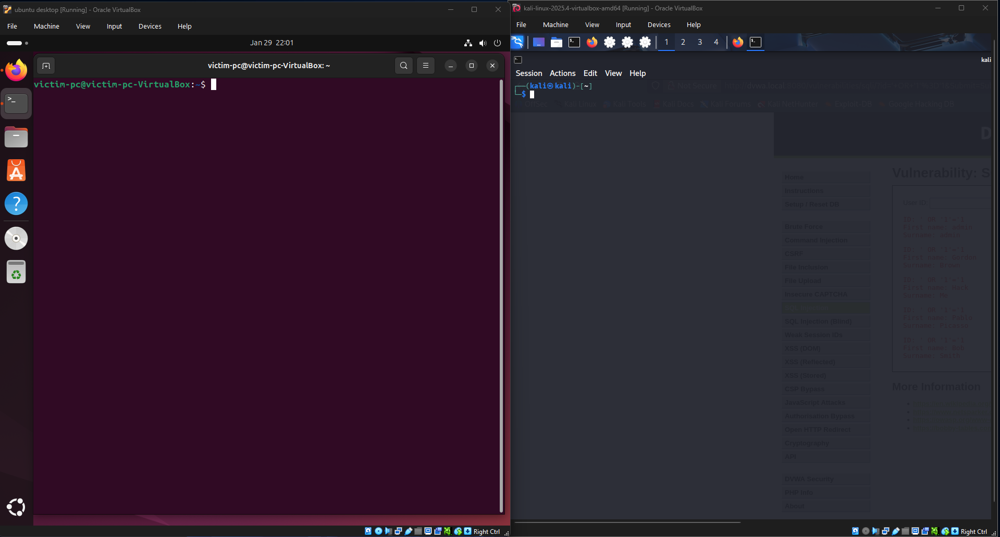
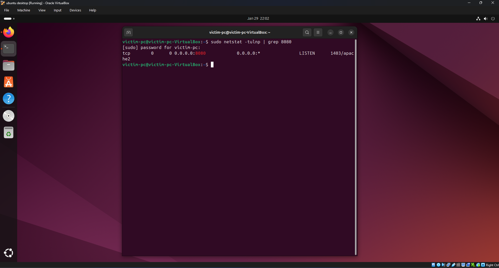
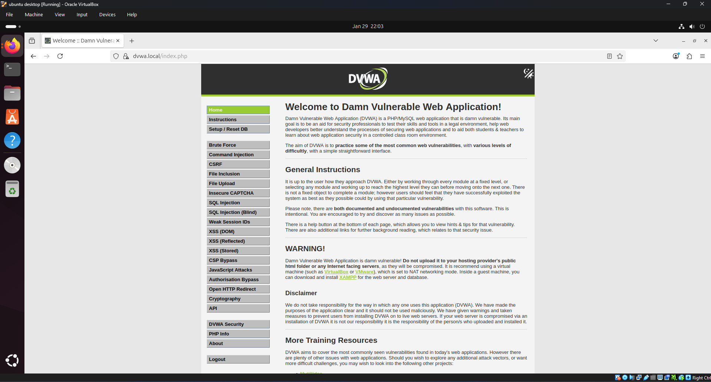
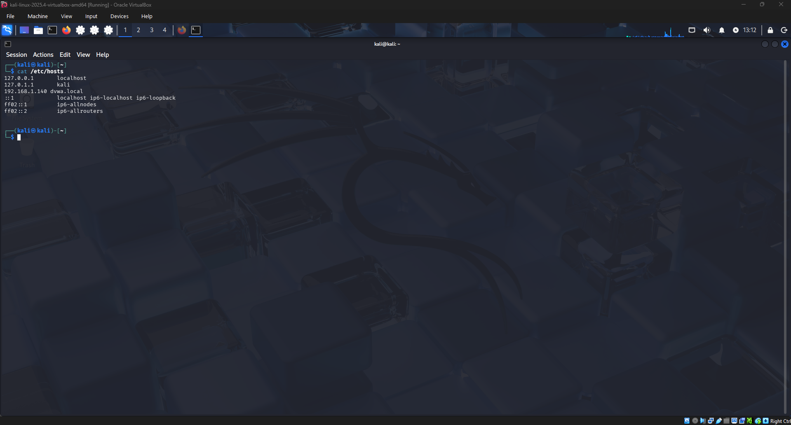
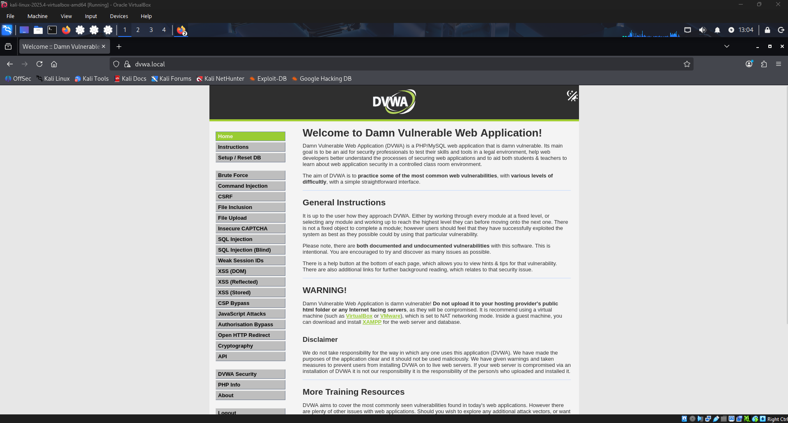
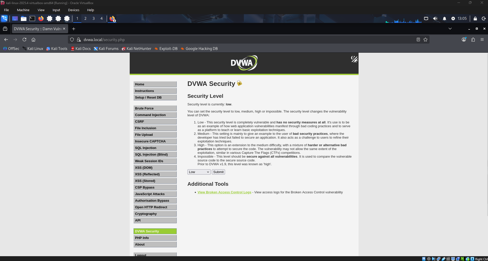
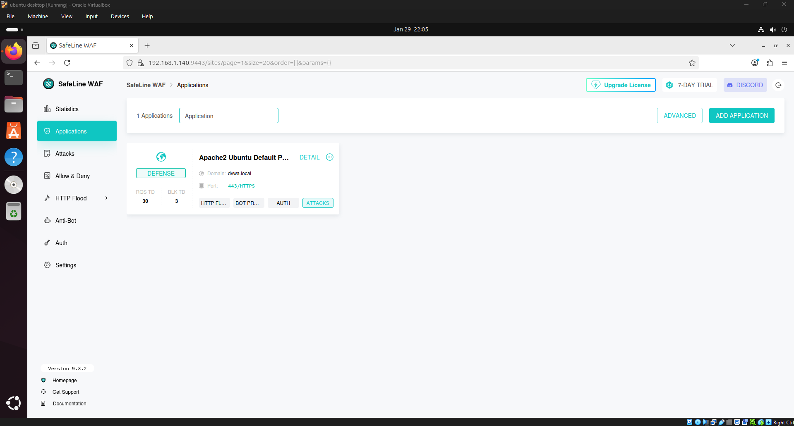
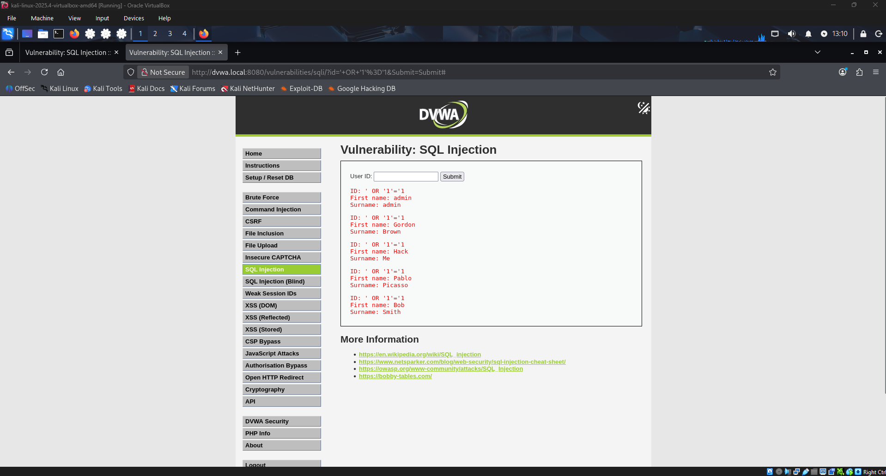
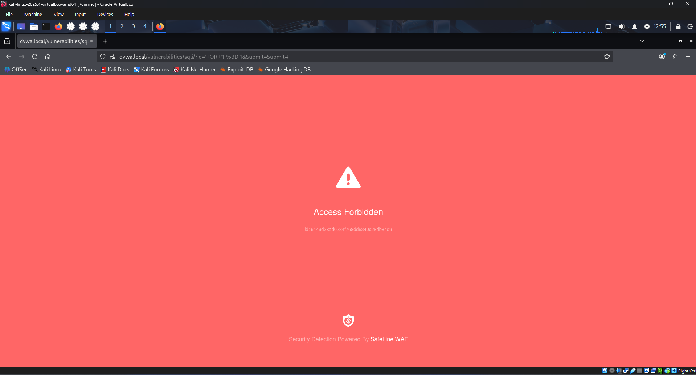

# dwva-waf
This lab demonstrates a vulnerable web application (DVWA) protected by a SafeLine WAF. The setup includes an attacker (Kali Linux) and a victim (Ubuntu with DVWA), simulating attacks such as SQL Injection and observing SafeLine’s automated protections.

## Lab Setup

- Ubuntu VM: DVWA host
- Kali VM: Attacker
- Bridged networking for full connectivity

---

## Apache & DVWA Setup

**Apache listening on IPv4:**

**DVWA running locally (Ubuntu):**

**DVWA accessible remotely (Kali):**

---

## DNS Resolution

Custom hostname mapped to the WAF IP (dvwa.local) to ensure all traffic goes through SafeLine.

Shows that Kali resolves DVWA through the WAF, not directly to the backend.

---

## DVWA Login

**Successful login from Kali through SafeLine WAF:**

**DVWA Security set to Low for testing:**

---

## SafeLine WAF

**SafeLine dashboard showing DVWA application:**

**SQL Injection attack attempt from Kali:**

**SafeLine blocking the attack:**

**SafeLine logs showing detected attacks:**

---

## Key Learnings

- Built a multi-VM lab (attacker + victim)
- Configured Apache & DVWA for remote access
- Tested vulnerabilities (SQLi) safely
- Validated WAF protections via SafeLine
- Documented attacks and logs for SOC-level insight
